# c-project
A random C project for bonus points. Self-explanatory, isn't it?

By the way, everything related to the project will be available in the Projects page.

# First thing to do
Hit the fork button. This will make a copy of the repo. From now on, you will work on your own fork.

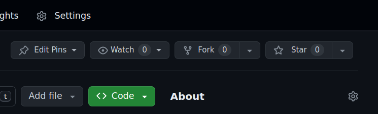

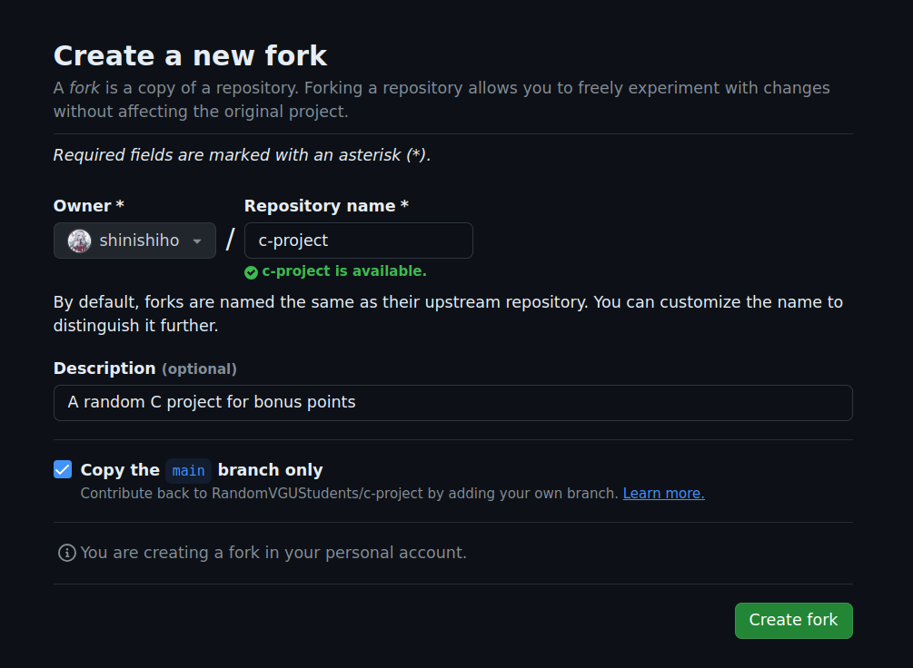

Click the "Create fork" button

# Working with Git in VSCode
<table>
<tr>
<th> Right here, the third icon </th>
<th> And this is what it looks like (in an active Git folder) </th>
</tr>
<tr>
<td>

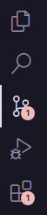

</td>
<td>

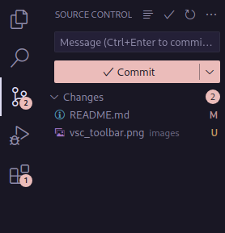

</td>
</tr>
</table>

## Getting started

### Clone this repository

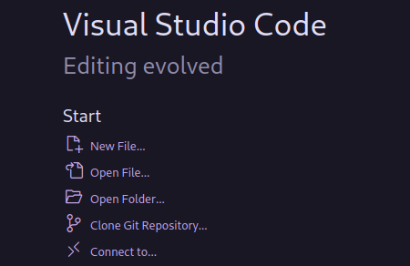

1. Can you see the line? Spank it.
It will ask you for the link.

  
Here is the link

  
  

  Anyway, you can copy the link from the browser in the address bar.
  Yeah, that will do it.
  Remeber to use the link of the forked repository, not the main one.

2. It will ask you to login using your GitHub account.
Yeah, this is a private repository, so only those with access can see and use it.
3. After that step, you are good to go!

### Use a remote workspace (requires Internet everytime)
If you can't use your own machine because of ~~skill issue~~ some reasons, or you just don't want to download any files, you can use GitHub Codespaces.

1. Click the "Connect to..." line, just below "Clone this repository..."
2. Select "GitHub Codespaces", and it will install an extension for you.
3. Login to your GitHub account.
4. If there is no Codespaces, just create a new one

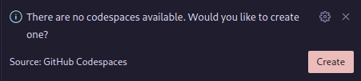
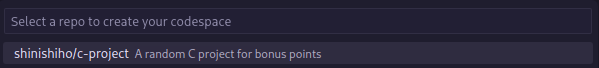
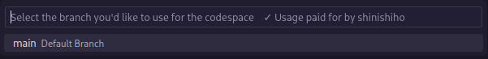
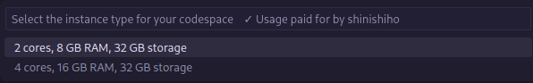

5. You are good to go!

## Working

### Commit & Push
Okay, you can see a big "Commit" button here.

What it does it "commit" (temporarily save) everything you have done.

Oh, I mean the files are still saved on your machine when you save or Ctrl+S or something, but they will only live in your machine. This step will get your work uploaded to the Internet.

1. Write a short description about what you did to the code.
E.g. `Replaced main.c with amogus.c`, or `Changed every "true" to "!false"`. (Alright please don't do any of those).
2. Hit the button.
3. The button will change to "Sync changes".
Hit it again to really send your work to the repository.
DON'T SKIP THIS STEP. I learned it the hard way.

### Pull request
After you have done a good milestone in your own fork, in the main page there will be a button to open a pull request. A pull request will open a discussion between all members before applying it to the main repository.

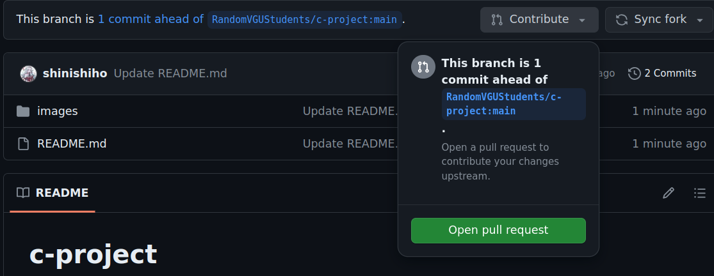

Click the green button.

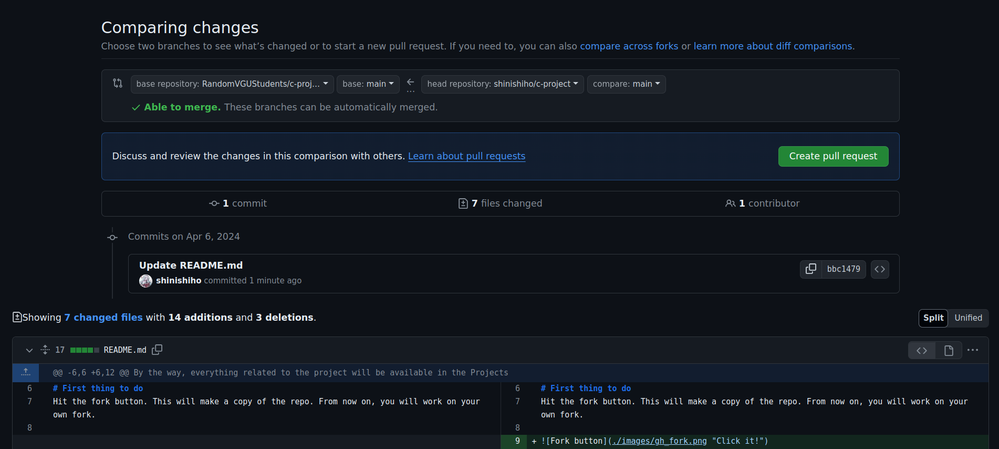

Another one.

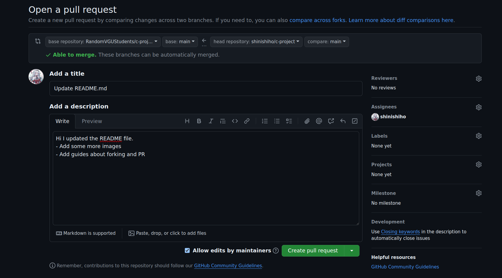

Another one.
