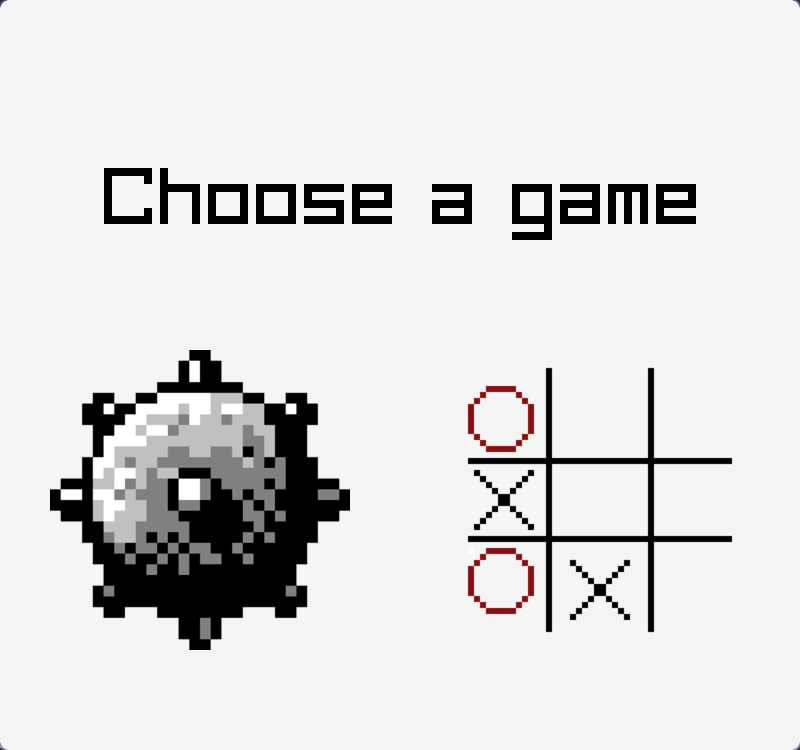

# Minesweeper & Tic Tac Toe (and beyond)
## How to get
### Windows

1. Click the green button "<> Code"
2. Click "Download ZIP"
3. Extract zip file and run `game.exe`
4. A small (weird) surprise awaits you in the UI (size slider)

### Linux

```bash
git clone https://github.com/RandomVGUStudents/c-project.git
cd c-project
make && ./gameui
```

## 3D Animation

I made a 3D animation for no reason.

[](https://www.youtube.com/watch?v=XOAA-efwiso)

## Screenshots




## More information

### Team members

- [Do Quang Minh - 10223049](https://github.com/shinishiho)
- [Huynh Ngoc Hoang Khang - 10223030](https://github.com/kanaciel)
- [Nguyen Duc Binh - 10223010](https://github.com/Scyclon)
- [Do Trong Le - 102230??](https://github.com/Mia-Shika)
- [Luong Nhat Minh - 102230??](https://github.com/Chefminh)
- [Ngo Bao Thien Khoi - 102230??](https://github.com/ngokhoi2308)
- [Do Khoi Nguyen - 102230??](https://github.com/Ngoendo)

### External library

- [Raylib](https://github.com/raysan5/raylib) (absolutely not sponsored)
